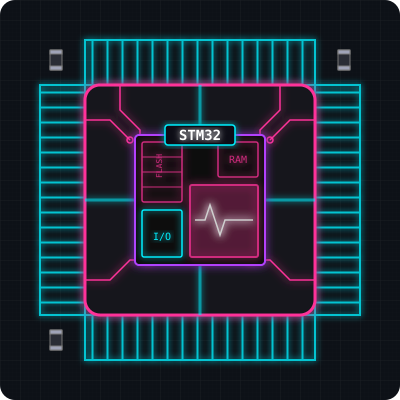

  <!-- Đã mã hóa chữ 'ê' thành '%C3%AA' và dùng server Vercel siêu ổn định -->
  

  
  

---

<!-- Cố định con chip bên phải (Tao giảm size xuống 350 một xíu để nhường chỗ cho rắn) -->

<h3>👋 Hi there, Good Day</h3>

I am a 3rd-year Computer Engineering student at HCMUT, passionate about hardware engineering and embedded systems. I enjoy diving deep into silicon, exploring new low-level architectures, and actively contributing to open-source hardware projects.

Currently, my focus is on <b>STM32 microcontrollers, FPGA logic design</b>, and <b>Enterprise Network Topologies</b>.

<!-- Ép con rắn sát vào chữ và bóp size xuống còn 480px để lọt gọn vào khoảng trống bên trái -->
<picture>
  <source media="(prefers-color-scheme: dark)" srcset="https://raw.githubusercontent.com/thanhphong2335/thanhphong2335/output/github-contribution-grid-snake-dark.svg">
  <source media="(prefers-color-scheme: light)" srcset="https://raw.githubusercontent.com/thanhphong2335/thanhphong2335/output/github-contribution-grid-snake.svg">
  
</picture>

  <!-- Chốt hạ dòng này để các phần Tool/Language bên dưới không bị trồi lên lộn xộn -->
---

### 🛠 Language and Tools

  <!-- Nhóm Ngôn ngữ Lập trình -->
  
  
  
  
    
  <!-- Nhóm Phần cứng & Phần mềm kỹ thuật -->
  
  
  
  

